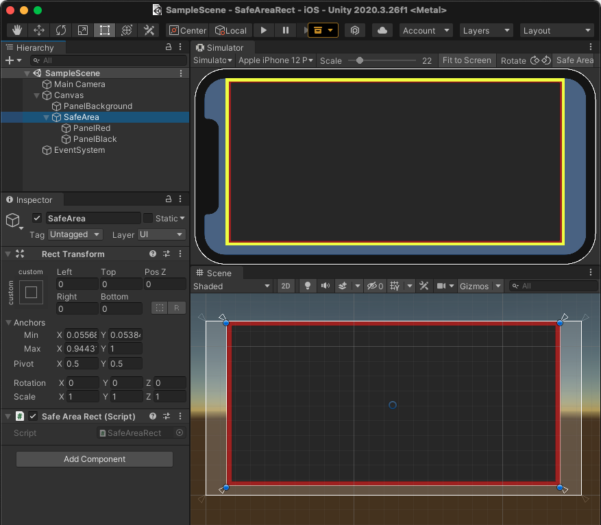

# SafeAreaRect
SafeArea RectTransform plugin for Unity

`SafeAreaRect` component automatically adjusts `RectTransform` to the size of the safe area.

To test your RectTransform, try to use [com.unity.device-simulator](https://docs.unity3d.com/Manual/com.unity.device-simulator.html)

# Support devices

SafeAreaRect uses [Unity - Scripting API: Screen.safeArea](https://docs.unity3d.com/2020.2/Documentation/ScriptReference/Screen-safeArea.html)

The supported devices are those supported by `Screen.safeArea`.

# Install

you can add `https://github.com/doyasu24/SafeAreaRect.git?path=Assets/Plugins/SafeAreaRect#1.0.0` to Package Manager

or import unitypackage from [release page](https://github.com/doyasu24/SafeAreaRect/releases).

# License

MIT License
